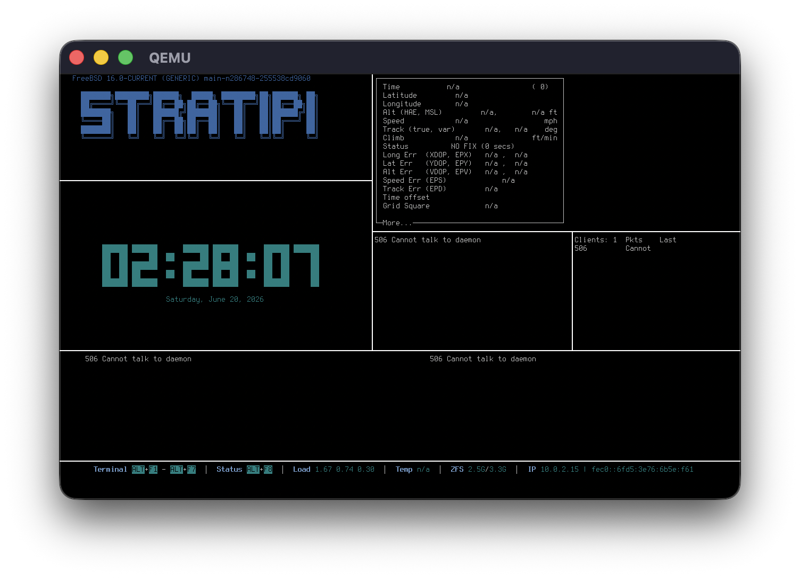

Stratipi turns a Raspberry Pi into a highly accurate Stratum-1 NTP network time server by using a connected GPS receiver under FreeBSD.

[](https://www.youtube.com/watch?v=gMqUo6gZD1M)

---

## Features

* Uses GPS with PPS for precise timekeeping
* Runs on FreeBSD via Raspberry Pi
* Provides Stratum-1 NTP service

---

## Hardware Requirements

* Compatible Single Board Computers
  * [Raspberry Pi 3 Model B](https://www.raspberrypi.com/products/raspberry-pi-3-model-b/)
  * [Raspberry Pi 3 Model B+](https://www.raspberrypi.com/products/raspberry-pi-3-model-b-plus/)
  * [Raspberry Pi 4 Model B](https://www.raspberrypi.com/products/raspberry-pi-4-model-b/)
  * [Raspberry Pi 400](https://www.raspberrypi.com/products/raspberry-pi-400/) _(pending upstream kernel bug fix)_
  * More coming soon!
* Compatible GPS Receiver
  * [Adafruit Ultimate GPS HAT for Raspberry Pi](https://www.adafruit.com/product/2324)
  * More in the future..?
* External GPS Antenna _(optional, for better signal)_
* Ethernet/network connectivity _(wired only, no wireless)_
* Micro-SD card
  * [Sandisk Industrial](https://www.sandisk.com/products/memory-cards/microsd-cards/industrial-microsd?sku=SDSDQAF3-008G-I) _(recommended)_
  * Others will work, reliability/performance may vary

---

## Installation

0. Download the Stratipi image file from [Releases](https://github.com/circuitrewind/stratipi/releases).
1. Flash Stratipi image onto the SD card.
2. Insert flashed SD card into the Raspberry Pi.
3. Attach the GPS HAT to the Raspberry Pi.
3. Plug in Ethernet cable to Raspberry Pi.
4. Power on the Raspberry Pi.
5. ...
6. PROFIT!

The Raspberry Pi will attempt to acquire an IPv4 address via DHCP automatically.

`Chrony` NTP server will also start serving time as soon as the OS fully boots up, synced to other public NTP servers to start with. As soon as GPS signal is fully locked and registering in `gpsd`, `Chrony` will shift time synchronization over to `GPS`+`PPS` automatically.

---
## Using Stratipi

Upon first bootup, Stratipi will automatically launch into a visual, non-interactive TUI dashboard to show system status.

This dashboard will show the acquired DHCP IP address in the bottom status bar, the most important piece of information for using Stratipi as a time server. Along with this, the dashboard also shows the system load over 1/5/15 minutes, the CPU temperature, and the consumed/total storage. The temperature metrics over time may become important as crystal oscillators used for clocks can drift faster/slower as thermal characteristics change which can be seen in the "Frequency" ppm metric in the middle of the screen.

The dashboard also shows the output of `chronyc tracking`,  `chronyc sourcestats`, `chronyc sources`, `chronyc clients` as well as `cgps`. These combined should give a solid indication as to the health of the unit.

`cgps` on the top-right: this displays the current health of the GPS signal, such as the number of visible satellites with their signal strength and relative location in the sky, as well as the number that are currently in use for triangulation.

`chronyc sources` + `chronyc sourcestats` on the bottom: these are combined into a single displays and show what `chrony` is using to determine the current time, as well as the accuracy of each source. When GPS is locked, the "Last sample" column should eventually fall to around 500-1500 nanoseconds after the clock jitter has settled down. This may take several minutes to a few hours after bootup for the clocks to reach this level of accuracy.

`chronyc tracking` on the very center: this displays how well the time is being applied to the local system clock as well as how accurate the clock is over time.

`chronyc clients` on the middle-right: this displays the most recently connect clients to the server and how long ago their last query was.

`tty-clock` on the middle-left: displays the current system time in UTC.




---

## Contributing

Contributions are welcome.
Please submit issues and pull requests to make Stratipi more AWESOME!

---

## Compiling / Building

On a FreeBSD 15.0 or newer system, run the following:
```
git clone https://github.com/circuitrewind/stratipi.git
cd stratipi
./build.sh
```
Yes, it is literally that simple and easy to run the build process to generate your own disk image file!

---

## License

This project is licensed under the BSD License.
See [`LICENSE`](https://github.com/circuitrewind/stratipi/blob/main/LICENSE) file for details.
